# Module 1: Lab 1 - Azure AD Privileged Identity Management


**Scenario**

In this lab, you'll learn how to use Azure Privileged Identity Management (PIM) to enable just-in-time administration and control the number of users who can perform privileged operations. You'll also learn about the different directory roles available as well as newer functionality that includes PIM being expanded to role assignments at the resource level. Lessons include:

- Getting Started with PIM
- PIM Security Wizard
- PIM for Directory Roles
- PIM for Role Resources

✔️ The Managing Identities course also covers Azure RBAC and Azure Active Directory. This content has been included here also to provide more context and foundation for the remainder of the course.


## Azure AD Privileged Identity Management

## Exercise 1 - Discover and Manage Azure Resources

### Task 1: Lab Setup


This lab requires creating a user that will be used for PIM.


1.  In the **Azure Portal** open the **Cloud Shell** in **PowerShell** mode. If prompted click **Create Storage**.

1.  Run the following PowerShell Commands to create an AD user and password in your default domain

    ```powershell
    $PasswordProfile = New-Object -TypeName Microsoft.Open.AzureAD.Model.PasswordProfile
    ```
    ```powershell
    $PasswordProfile.Password = "Pa55w.rd"
    ```
    ```powershell
    $domainObj = get-azureaddomain
    ```
    ```powershell
    $domain = $domainObj[0].name
    ```
    ```powershell
     New-AzureADUser -DisplayName "Isabella Simonsen" -PasswordProfile $PasswordProfile -UserPrincipalName "Isabella@$domain" -AccountEnabled $true -MailNickName "Isabella" -UsageLocation "US"
    ```
### Task 2:  Enable Azure AD Premium P2 trial and create a test user.

1.  In the Azure Portal, on the Hub menu click **Azure Active Directory**.

1.  Select **Licences** then **All Products**.

1.  Click **Try / Buy**.

     

1.  Click the drop down arrow and select **Activate** on the **Azure AD Premium P2** product.

     

**You may need to log out of the Azure portal and log in again for this to refresh**

### Task 3: Discover resources

1.  In the Azure Portal, click **All services** and search for and select **Azure AD Privileged Identity Management**.

     

1.  Click consent to PIM.

     

1.  Click **Verify my identity**.

     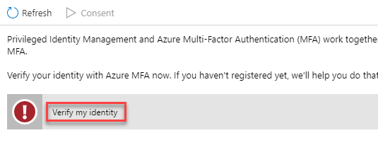

1.  Click **Next**.

     

1.  Enter your mobile/cell phone details and click **Next**.

     
 
1.  Enter the code when you receive it via SMS and click **Verify**.

     

1. Once the verification is successful, click **Done**.

1.  In the Azure Portal, click **All services** and search for and select **Azure AD Privileged Identity Management**.

     

1.  Click consent to PIM.

     

1.  Back on the **Consent to PIM blade** click **Consent** and click **Yes**.

     

1.  Refresh the Azure Portal by pressing **F5**.
   
    **Note**: If by refreshing the portal in the browser does not display PIM as being enabled then log out and back into the Azure Portal.

2.  Click **Azure resources**.

     


3.  Click **Discover resources** to launch the discovery experience.

     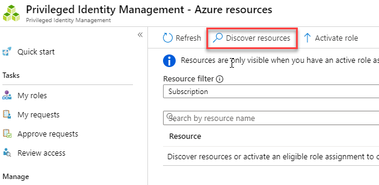


4.  On the Discovery pane, use **Resource state filter** and **Select resource type** to filter the management groups or subscriptions you have write permission to. It's probably easiest to start with **All** initially.

     

5.  Add a checkmark next to your Azure subscription.
   
     
 
6.  Click **Manage resource** to start managing the selected resources.

     

7.  Click **Yes** when prompted.


    **Note**: You can only search for and select management group or subscription resources to manage using PIM. When you manage a management group or a subscription in PIM, you can also manage its child resources.


    **Note**: Once a management group or subscription is set to managed, it can't be unmanaged. This prevents another resource administrator from removing PIM settings.


## Exercise 2 - Assign Directory Roles

### Task 1:  Make a user eligible for a role


In the following task you will make  a user eligible for an Azure AD directory role.


1.  Sign in to Azure portal

1.  In the Azure Portal, click **All services** and search for and select **Azure AD Privileged Identity Management**.

     

1.  Select **Azure AD Roles**.

     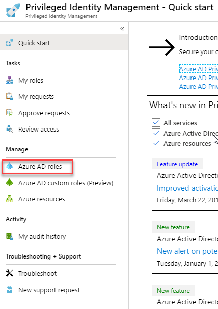
 
1.  Click **Sign up PIM for Azure AD Roles**.

     


1.  Click **Sign Up** and click **Yes**.

     

1.  **Refresh the Broswer**.

1.  Click **Roles**.

     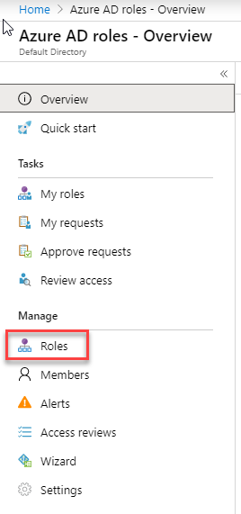


1.  Click **Add member** to open Add managed members.

     

1.  Click **Select a role**, and click **Billing Administrator** and then click  **Select**.

     

1.  Click **Select members**, select **Isabella** and then click **Select**.

     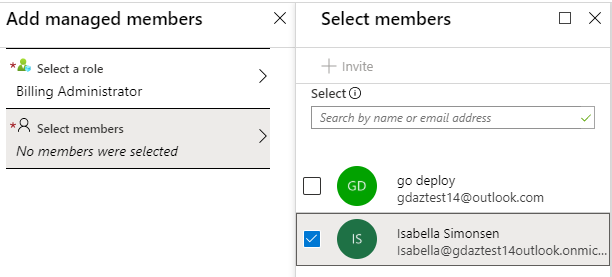

1.  In Add managed members, click **OK** to add the user to the role.

1.  Review the added member

     

1.  When the role is assigned, the user you selected will appear in the members list as **Eligible** for the role.


### Task 2: Make a role assignment permanent


By default, new users are only eligible for a directory role. Follow these steps if you want to make a role assignment permanent.


1.  In the Azure Portal, click **All services** and search for and select **Azure AD Privileged Identity Management**.

     

1.  Click **Azure AD roles**.

     

1.  Click **Members**.

     

1.  Click the **Eligible** role that you want to make permanent.

     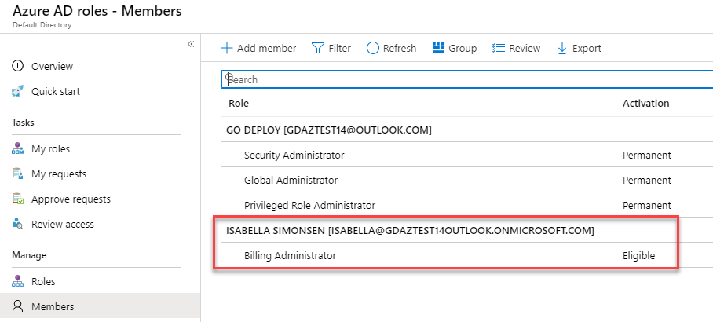
 
1.  Click **More** and then click **Make permanent**.

     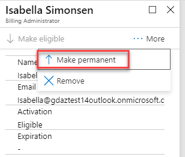
 

**Results**: The role is now listed as **permanent**.


### Task 3: Remove a user from a role


You can remove users from role assignments, but make sure there is always at least one user who is a permanent Global Administrator.


1.  In the Azure Portal, click **All services** and search for and select **Azure AD Privileged Identity Management**.

     

1.  Click **Azure AD roles**.

     

1.  Click **Members**.

     

1.  Click a role assignment you want to remove.

     
 
1.  Click **More** and then click **Remove**.

     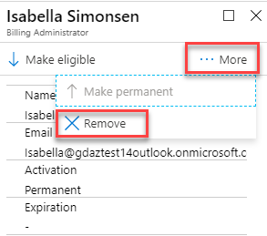
 
1.  In the message that asks you to confirm, click **Yes**. The role assignment will be removed.


## Exercise 3 - Activate and Deactivate PIM Roles

### Task 1: Activate a role


When you need to take on an Azure AD directory role, you can request activation by using the **My roles** navigation option in PIM.


1.  In the Azure Portal, click **All services** and search for and select **Azure AD Privileged Identity Management**.

     

1.  Click **Azure AD roles**.

     
 
1.  Click **Quick Start** and click **Assign eligibility**.

     

1.  Click **Billing Administrator** and add Isabella back into the **Billing Administrators** role.


1.  Open an **In Private** browsing session and navigate to **`https://portal.azure.com`** and login as **Isabella** using her UPN. example Isabella@myaad.onmicrosoft.com with the password **Pa55w.rd**.  When prompted change Isabella's password.

1.  In the Azure Portal, click **All services** and search for and select **Azure AD Privileged Identity Management**.

     

1.  Click **Azure AD roles**.

     

1.  Click **Quick start** and click **Activate your role**.

     

1.  On the Billing Administrator role, scroll to the right and click **Activate**.

     

1.  Click **Verify your identity before proceeding**. You only have to authenticate once per session. Run through the wizard to authenticate Isabella.

     
 
1.  Once returned to the Azure Portal, click **All services** and search for and select **Azure AD Privileged Identity Management**.

     

1.  Select **Azure AD Roles** then click click **Activate your role** on the Quick start blade.

1.  On the Billing Administrator role, scroll to the right and click **Activate**.

     

1.  Click **Activate**.

     

1.  Enter an activation reason and click **Activate**

     

By default, roles do not require approval unless configured explicitly in settings. 

 If the role does not require approval, it is activated and added to the list of active roles. If you want to use the role right away, follow the steps in the next section.

 If the role requires approval to activate, a notification will appear in the upper right corner of your browser informing you the request is pending approval.


### Task 2: Use a role immediately after activation


When you activate a role in PIM, it can take up to 10 minutes before you can access the desired administrative portal or perform functions within a specific administrative workload. To force an update of your permissions, use the **Application access** page as described in the following steps.


1.  Click **Sign Out**.

     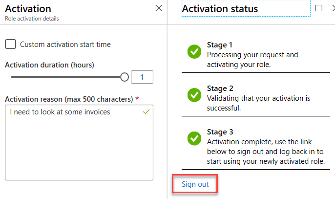

1.  Log back in as Isabella.


### Task 3: View the status of your requests


You can view the status of your pending requests to activate.


1.  Still signed in as **Isabella**, in the Azure Portal, click **All services** and search for and select **Azure AD Privileged Identity Management**.

     

1.  Click **Azure AD Roles**.

1.  Click **My requests** to see a list of your requests.

     

### Task 4: Deactivate a role


Once a role has been activated, it automatically deactivates when its time limit (eligible duration) is reached.

If you complete your administrator tasks early, you can also deactivate a role manually in Azure AD Privileged Identity Management.


1.  Still signed in as **Isabella**, open Azure AD Privileged Identity Management.

1.  Click **Azure AD roles**.

1.  Click **My roles**.

     

1.  Click **Active roles** to see your list of active roles.

     

1.  Find the role you're done using and then click **Deactivate**.

     

1.  Click **Deactivate** again.

     

1.  Click **Yes** to confirm.


### Task 5: Cancel a pending request


If you do not require activation of a role that requires approval, you can cancel a pending request at any time.


1.  **Open Azure AD Privileged Identity Management**.

1.  Click **Azure AD roles**.

1.  Click **My requests**.

1.  For the role that you want to cancel, click the **Cancel** button.

**Note**: The cancel button in this task is greyed out as the request was approved.

When you click Cancel, the request will be cancelled. To activate the role again, you will have to submit a new request for activation.


## Exercise 4 - Directory Roles (General)

### Task 1: Start an access review for Azure AD directory roles in PIM


Role assignments become "stale" when users have privileged access that they don't need anymore. In order to reduce the risk associated with these stale role assignments, privileged role administrators or global administrators should regularly create access reviews to ask admins to review the roles that users have been given. This task covers the steps for starting an access review in Azure AD Privileged Identity Management (PIM).


1.  Return back to the browser that is logged in as your Global Admin Account.

1.  From the PIM application main page click **Azure AD Roles** under the **Manage** section click **Access reviews** and click > **New**.

     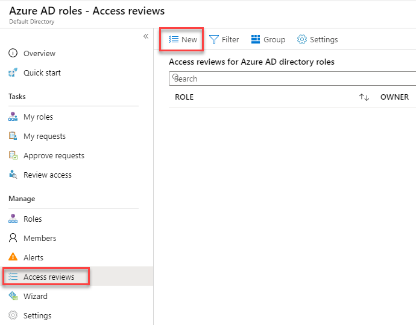

1.  Enter the following details and click **Start**:

      - Review name:  **Global Admin Review**
      - Start Date:  **Today's Date** 
      - Frequency: **One time**
      - End Date:  **End of next month**
      - Review role membership:  **Global Administrator**
      - Reviewers:  **Select your account**
 
 
     
 
1.  Once the review has completed and has a status of Active, click on the **Global Admin Review**.

1.  Select **Results** and see the outcome of **Not reviewed**.

     

### Task 2: Approve or deny access


When you approve or deny access, you're just telling the reviewer whether you still use this role or not. Choose Approve if you want to stay in the role, or Deny if you don't need the access anymore. Your status won't change right away, until the reviewer applies the results. Follow these steps to find and complete the access review:


1.  In the PIM application, select **Review access**. 

2.  Select the **Global Admin Review**.

     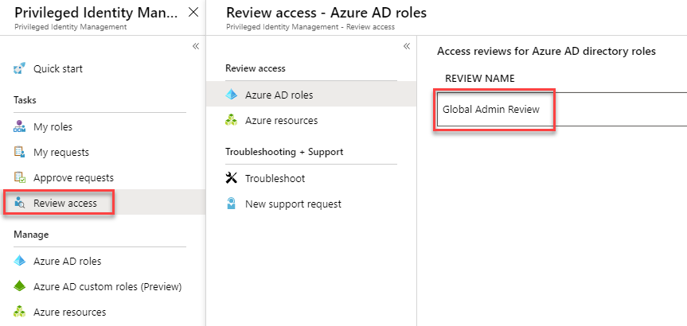

3.  Unless you created the review, you appear as the only user in the review. Select the check mark next to your name.

     

5.  Close the **Review Azure AD roles** blade.

### Task 3: Complete an access review for Azure AD directory roles in PIM


Privileged role administrators can review privileged access once an access review has been started. Azure AD Privileged Identity Management (PIM) will automatically send an email prompting users to review their access. If a user did not get an email, you can send them the instructions in how to perform an access review.

After the access review period is over, or all the users have finished their self-review, follow the steps in this task  to manage the review and see the results.


1.  Go to the Azure portal and select the **Azure AD Privileged Identity Management**.

1.  Select **Azure AD Roles**.

2.  Select the **Access reviews**.


3.  Select the Global Admin Review.


1.  Review the blade.

     


### Task 4: Configure security alerts for Azure AD directory roles in PIM


You can customize some of the security alerts in PIM to work with your environment and security goals. Follow these steps to open the security alert settings:


1.  Open **Azure AD Privileged Identity Management**.

1.  Click **Azure AD roles**.

1.  Click **Settings** and then **Alerts**.


1.  Click an alert name to configure the setting for that alert.


## Exercise 5 - PIM Resource Workflows

### Task 1:  Configure the Global Administrator role to require approval.

1.  Open **Azure AD Privileged Identity Management**.

1.  Click **Azure AD roles**.

1.  Click **Settings** 

1.  Click **Roles** and select **Global Administrator**.

1.  Scroll down and change **Require Approval** to **Enable** and click **Save**.

     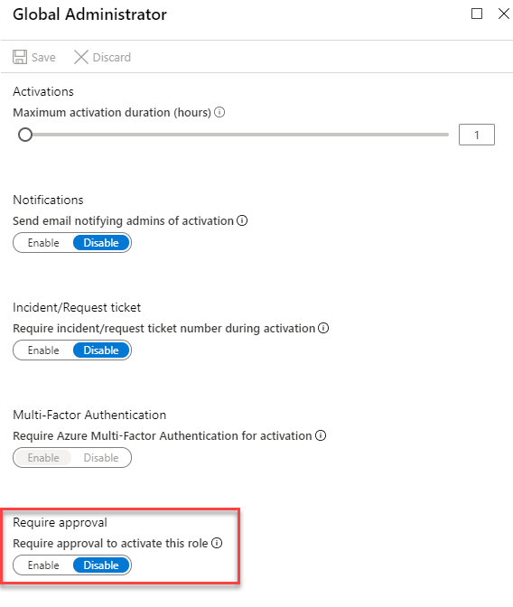

### Task 2: Enable Isabella for Global Administrator privileges.

1.  Open **Azure AD Privileged Identity Management**.

1.  Click **Azure AD roles**.

1.  Click the **Quick Start** and select **Assign eligibility**.

     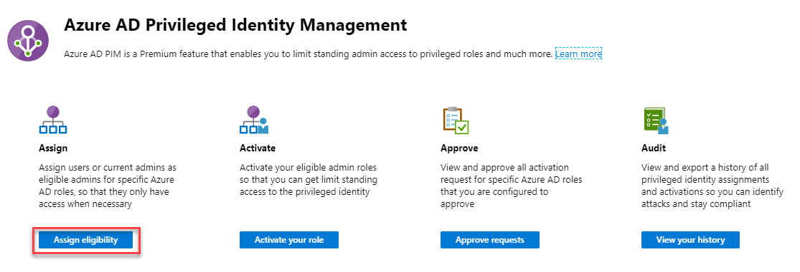

1.  Select **Global Administrator**.


1.  Select **+ Add Member** and select **Isabella**.


1.  Open an in Private Browsing session and login to portal.azure.com as Isabella.

1.  Open **Azure AD Privileged Identity Management**.

1.  Select **My Roles**.

     

1.  **Activate** the Global Administrator Role.

     

1.  Verify Isabella's identity using the wizard.

     

1.  Return back to **My Roles** in **Azure AD Privileged Identity Management**.

1.  **Activate** the Global Administrator Role.

1.  Click **Activate**.

     

1.  Enter the justification **I need to carry out some administrative tasks** and click **Acitvate**.

     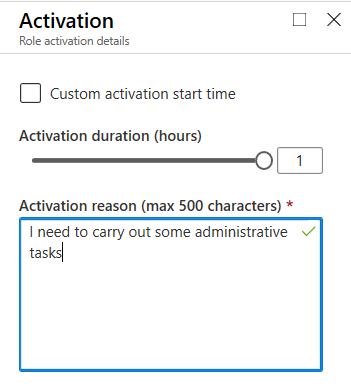


### Task 3: Approve or deny requests for Azure resource roles in PIM


With Azure AD Privileged Identity Management (PIM), you can configure roles to require approval for activation, and choose one or multiple users or groups as delegated approvers. Follow the steps in this article to approve or deny requests for Azure resource roles.


###### View pending requests


As a delegated approver, you'll receive an email notification when an Azure resource role request is pending your approval. You can view these pending requests in PIM.


1.  Switch back to the browser you are signed in with your Gloabl Administrative account.

1.  Open **Azure AD Privileged Identity Management**.

1.  Click **Approve requests**.

     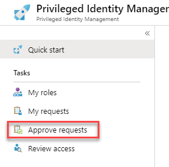

1.  Click the request from Isabella and click **Approve**.

     

1.  Enter a reason **Granted for this task"" and click **Approve**.

      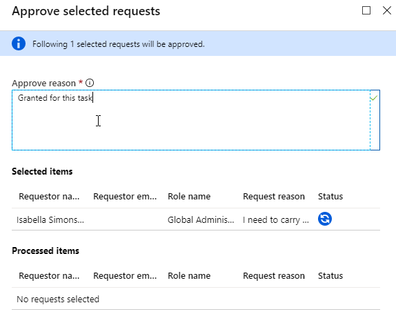

1.  A notification appears with your approval.

     

1.  Switch back to the In Private Browsing session where Isabella is signed in and click My Roles and note the status is now approved.

     

## Exercise 6 - View audit history for Azure AD roles in PIM


You can use the Azure Active Directory (Azure AD) Privileged Identity Management (PIM) audit history to see all the role assignments and activations within the past 30 days for all privileged roles. If you want to see the full audit history of activity in your directory, including administrator, end user, and synchronization activity, you can use the [Azure Active Directory security and activity reports](https://docs.microsoft.com/en-us/azure/active-directory/reports-monitoring/overview-reports).


### Task 1: View audit history


Follow these steps to view the audit history for Azure AD roles.


1.  Open **Azure AD Privileged Identity Management**.

1.  Click **Azure AD roles**.

1.  Click **Directory roles audit history**.

    Depending on your audit history, a column chart is displayed along with the total activations, max activations per day, and average activations per day.

    At the bottom of the page, a table is displayed with information about each action in the available audit history. The columns have the following meanings:

    | Column | Description |
    | --- | --- |
    | Time | When the action occurred. |
    | Requestor | User who requested the role activation or change. If the value is **Azure System**, check the Azure audit history for more information. |
    | Action | Actions taken by the requestor. Actions can include Assign, Unassign, Activate, Deactivate, or AddedOutsidePIM. |
    | Member | User who is activating or assigned to a role. |
    | Role | Role assigned or activated by the user. |
    | Reasoning | Text that was entered into the reason field during activation. |
    | Expiration | When an activated role expires. Applies only to eligible role assignments. |

1.  To sort the audit history, click the **Time**, **Action**, and **Role** buttons.

### Task 2: Filter audit history

1.  At the top of the audit history page, click the **Filter** button.

    The **Update chart parameters** pane appears.

1.  In **Time range**, select a time range.

1.  In **Roles**, add checkmarks for the roles you want to view.

1.  Click **Done** to view the filtered audit history.


**Results**: You have now completed this lab.


