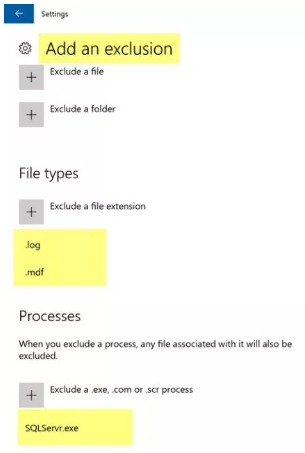

# Module 2: Lab 16 - Antimalware for VMs

**Scenario**

Azure Security Center monitors the status of antimalware protection and reports this on the Endpoint protection issues blade. Security Center notes issues, such as detected threats and insufficient protection, that might make your VMs and computers vulnerable to malware threats. 
By using the information on Endpoint protection issues, you can make a plan to address any identified issues. 

Security Center reports the following endpoint protection issues: 

- Endpoint protection not installed on Azure VMs. A supported antimalware solution isn't installed on these Azure VMs. 
- Endpoint protection not installed on non-Azure computers. A supported antimalware solution isn't installed on these non-Azure computers.
- Endpoint protection health issues:  

- **Signature out of date**. An antimalware solution is installed on these VMs and computers, but the solution doesn't have the latest antimalware signatures. 
  - **No real time protection**. An antimalware solution is installed on these VMs and computers, but it isn't configured for real-time protection. The service might be disabled, or Security Center might be unable to obtain the status because the solution isn't supported. 
 - **Not reporting**. An antimalware solution is installed but not reporting data. 
 - **Unknown**. An antimalware solution is installed, but either its status is unknown or it's reporting an unknown error.

## Exercise 1: Deploy Antimalware for Azure VMs.

## Task 1: Create an Azure Virtual Machine with the Antimalware extension

Enable and configure antimalware for VMs To enable and configure Microsoft Antimalware for Azure VMs by using the Azure portal while provisioning a VM, complete the following steps: 

1.  Sign in to the **Azure portal** at **`https://portal.azure.com`**

2.  To create a new VM, navigate to **Virtual machines**, select Add, and then select **Windows Server under the image dropdown**.

1.  Enter the following details for the VM:

 | Option | Answer |
 | -- | --|
 | Resource Group | Create new > **myResourceGroup** |
 | VM Name | **myVM** |
 | Region | **East US** |
 | Image | **Windows Server 2019 Datacenter** |
 | Username | **localadmin** |
 | Password | **Pa55w.rd1234** |

1.  Click the **Management** Tab and ensure all the radio buttons are set to **Off**.

1.  Click the **Advanmced** Tab and click **Select an extension to install**.

1.  Select the **Microsoft Antimalware** extension.  _You may need to click Load More at the bottom of the list to see the extension._

11.  On the **Microsoft Antimalware** blade click **Create**. 
12.  In the Install extension section, you can configure files, locations, process exclusions, and other scan options. 

1.  In the Excluded file types enter **.mdf;.log** 

1.  In the Excluded processes enter **SQLServr.exe** 

1.  Select **OK**. 

14.  Back in the Settings section, select **Review + create**. 
15.  Click **Create** on the validation screen. 
16.  Once the VM has created log onto the VM via RDP and open Microsoft Antimalware > Exclusions to verify the deployment was successful.

     

| WARNING: Prior to continuting you should remove all resources used for this lab.  To do this in the **Azure Portal** click **Resource groups**.  Select any resources groups you have created.  On the resource group blade click **Delete Resource group**, enter the Resource Group Name and click **Delete**.  Repeat the process for any additional Resource Groups you may have created. **Failure to do this may cause issues with other labs.** |
| --- |

**Results**: You have now completed this lab.

