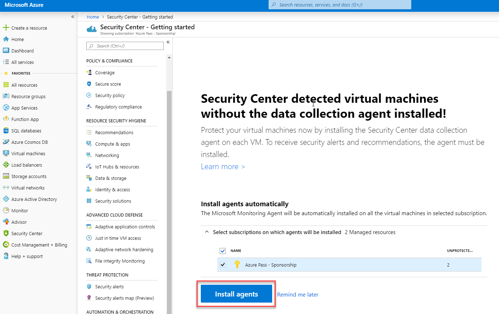
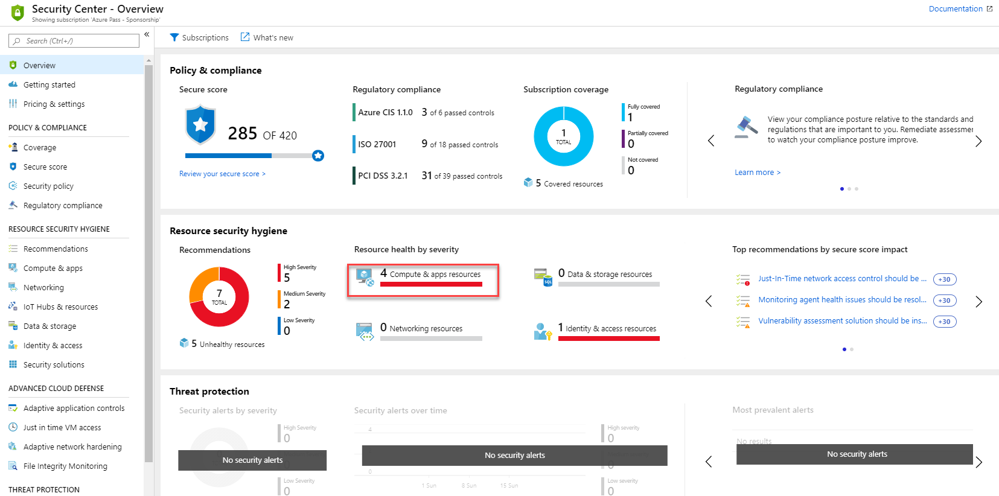
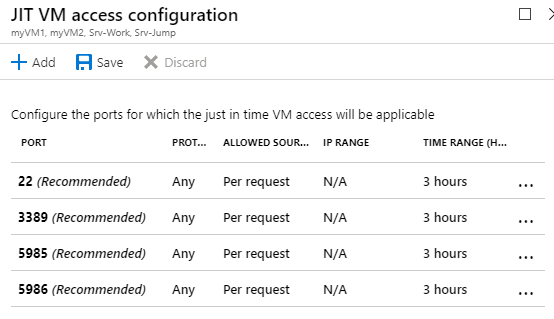
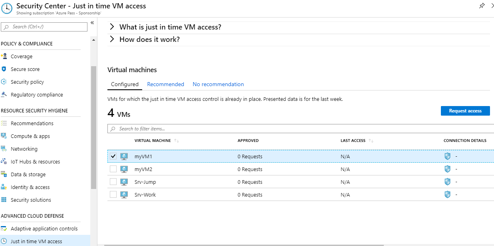
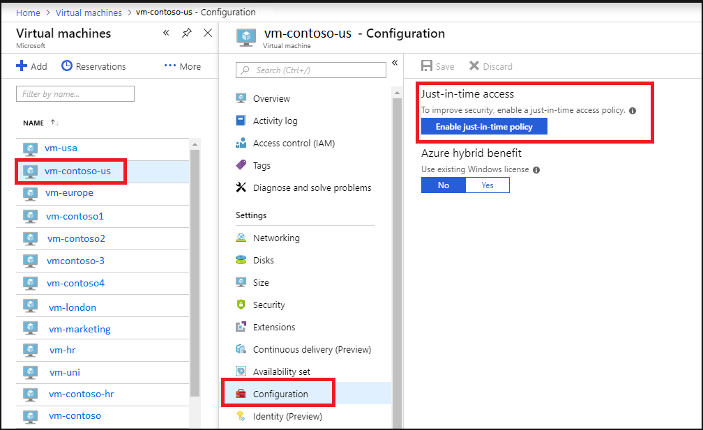

# Module 4: Lab 9 - JIT

**Scenario**

Just-in-time (JIT) virtual machine (VM) access can be used to lock down inbound traffic to your Azure VMs, reducing exposure to attacks while providing easy access to connect to VMs when needed.

Brute force attacks commonly target management ports as a means to gain access to a VM. If successful, an attacker can take control over the VM and establish a foothold into your environment.

One way to reduce exposure to a brute force attack is to limit the amount of time that a port is open. Management ports don't need to be open at all times. They only need to be open while you're connected to the VM, for example to perform management or maintenance tasks. When just-in-time is enabled, Security Center uses network security group (NSG) and Azure Firewall rules, which restrict access to management ports so they cannot be targeted by attackers.

## Exercise 1: Manage virtual machine access using just-in-time

There are three ways to configure a JIT policy on a VM:

- Configure JIT access in Azure Security Center
- Configure JIT access in an Azure VM blade
- Configure a JIT policy on a VM programmatically

### Task 1: Configure JIT access on a VM in Azure Security Center

1.  In the Azure Portal open the **Security Center** and then click **Getting Started**.

1.  Click **Install agents**.

     

**Note**: You may have to wait upto 5 minutes for the agents to deploy.

2.  In the left pane, select **Overview**.

1.  Select **Compute & app resources**.

     

1.  On the Compute blade, note the recommendations.

1.  Select the **Just-In-Time network access control should be applied on virtual machines**.

     

1.  Select all 4 virtual machines and click **Enable JIT on 4 VMs**.

     

1.  On the **JIT VM access configuration** blade click **Save**.
  - This blade displays the default ports recommended by Azure Security Center:
      - 22 - SSH
      - 3389 - RDP
      - 5985 - WinRM 
      - 5986 - WinRM
 
     

1.  Close all the blade and on the Security Center blade click **Just in time VM access**.

     

    The **Just-in-time VM access** window opens.
      
    **Just-in-time VM access** provides information on the state of your VMs:

    - **Configured** - VMs that have been configured to support just-in-time VM access. The data presented is for the last week and includes for each VM the number of approved requests, last access date and time, and last user.
    - **Recommended** - VMs that can support just-in-time VM access but haven't been configured to. We recommend that you enable just-in-time VM access control for these VMs.
    - **No recommendation** - Reasons that can cause a VM not to be recommended are:
      - Missing NSG - The just-in-time solution requires an NSG to be in place.
      - Classic VM - Security Center just-in-time VM access currently supports only VMs deployed through Azure Resource Manager. A classic deployment is not supported by the just-in-time solution. 
      - Other - A VM is in this category if the just-in-time solution is turned off in the security policy of the subscription or the resource group, or if the VM is missing a public IP and doesn't have an NSG in place.
 

**Note**: When JIT VM Access is enabled for a VM, Azure Security Center creates "deny all inbound traffic" rules for the selected ports in the network security groups associated and Azure Firewall with it. If other rules had been created for the selected ports, then the existing rules take priority over the new "deny all inbound traffic" rules. If there are no existing rules on the selected ports, then the new "deny all inbound traffic" rules take top priority in the Network Security Groups and Azure Firewall.

### Task 2: Request JIT access via ASC

To request access to a VM via ASC:

1.  Under **Just in time VM access**, select the **Configured** tab.

2.  Under **Virtual Machine**, select one of the VMs that you want to request access for. This puts a checkmark next to the VM.

    - The icon in the **Connection Details** column indicates whether JIT is enabled on the NSG or FW. If it's enabled on both, only the Firewall icon appears.

    - The **Connection Details** column provides the information required to connect the VM, and its open ports.

      

3.  Click **Request access**. The **Request access** window opens.

       

4.  Under **Request access**, for each VM, configure the ports that you want to open and the source IP addresses that the port is opened on and the time window for which the port will be open. It will only be possible to request access to the ports that are configured in the just-in-time policy. Each port has a maximum allowed time derived from the just-in-time policy.

5.  Click **Open ports**.

**Note**: If a user who is requesting access is behind a proxy, the option **My IP** may not work. You may need to define the full IP address range of the organization.

### Task 3:  Edit a JIT access policy via ASC

You can change a VM's existing just-in-time policy by adding and configuring a new port to protect for that VM, or by changing any other setting related to an already protected port.

To edit an existing just-in-time policy of a VM:

1.  In the **Configured** tab, under **VMs**, select a VM to which to add a port by clicking on the three dots within the row for that VM. 

1.  Select **Edit**.
1.  Under **JIT VM access configuration**, you can either edit the existing settings of an already protected port or add a new custom port. 
  
      

### Task 4:  Audit JIT access activity in ASC

You can gain insights into VM activities using log search. To view logs:

1.  Under **Just-in-time VM access**, select the **Configured** tab.
2.  Under **VMs**, select a VM to view information about by clicking on the three dots within the row for that VM and select **Activity Log** in the menu. The **Activity log** opens.

       

   **Activity log** provides a filtered view of previous operations for that VM along with time, date, and subscription.

You can download the log information by selecting **Click here to download all the items as CSV**.

Modify the filters and click **Apply** to create a search and log.

### Task 5: Configure JIT access on a VM via the Azure VM blade

To make it easy to roll out just-in-time access across your VMs, you can set a VM to allow only just-in-time access directly from within the VM.

1.  In the Azure portal, select **Virtual machines**.

2.  Click on the virtual machine you want to limit to just-in-time access.
3.  In the menu, click **Configuration**.
4.  Under **Just-in-time-access** click **Enable just-in-time policy**. 

    This enables just-in-time access for the VM using the following settings:

       - Windows servers:
         - RDP port 3389
         - Three hours of maximum allowed access
         - Allowed source IP addresses is set to Any
    
       - Linux servers:
         - SSH port 22
         - Three hours of maximum allowed access
         - Allowed source IP addresses is set to Any
     
    If a VM already has just-in-time enabled, when you go to its configuration page you will be able to see that just-in-time is enabled and you can use the link to open the policy in Azure Security Center to view and change the settings. 

     

### Task 5:  Request JIT access to a VM via the Azure VM blade

In the Azure portal, when you try to connect to a VM, Azure checks to see if you have a just-in-time access policy configured on that VM.

- If you do have a JIT policy configured on the VM, you can click **Request access** to enable you to have access in accordance with the JIT policy set for the VM. 

     

  The access is requested with the following default parameters:

  - **source IP**: 'Any' (*) (cannot be changed)
  - **time range**: Three hours (cannot be changed) 
  - **port number** RDP port 3389 for Windows / port 22 for Linux (can be changed)

  **Note**: After a request is approved for a VM protected by Azure Firewall, Security Center provides the user with the proper connection details (the port mapping from the DNAT table) to use to connect to the VM.

  - If you do not have JIT configured on a VM, you will be prompted to configure a JIT policy it.

      

| WARNING: Prior to continuting you should remove all resources used for this lab.  To do this in the **Azure Portal** click **Resource groups**.  Select any resources groups you have created.  On the resource group blade click **Delete Resource group**, enter the Resource Group Name and click **Delete**.  Repeat the process for any additional Resource Groups you may have created. **Failure to do this may cause issues with other labs.** |
| --- |

**Results**: You have now completed this lab.

